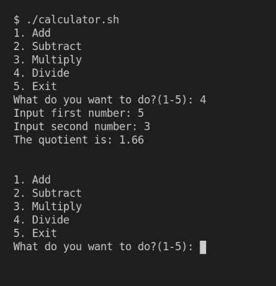

# Basic Calculator using Bash



## Getting Started

  

Clone the repository then ensure `calculator.sh` has executable permission.
```
chmod +x calculator.sh
```
Run the script
```
./calculator.sh
```